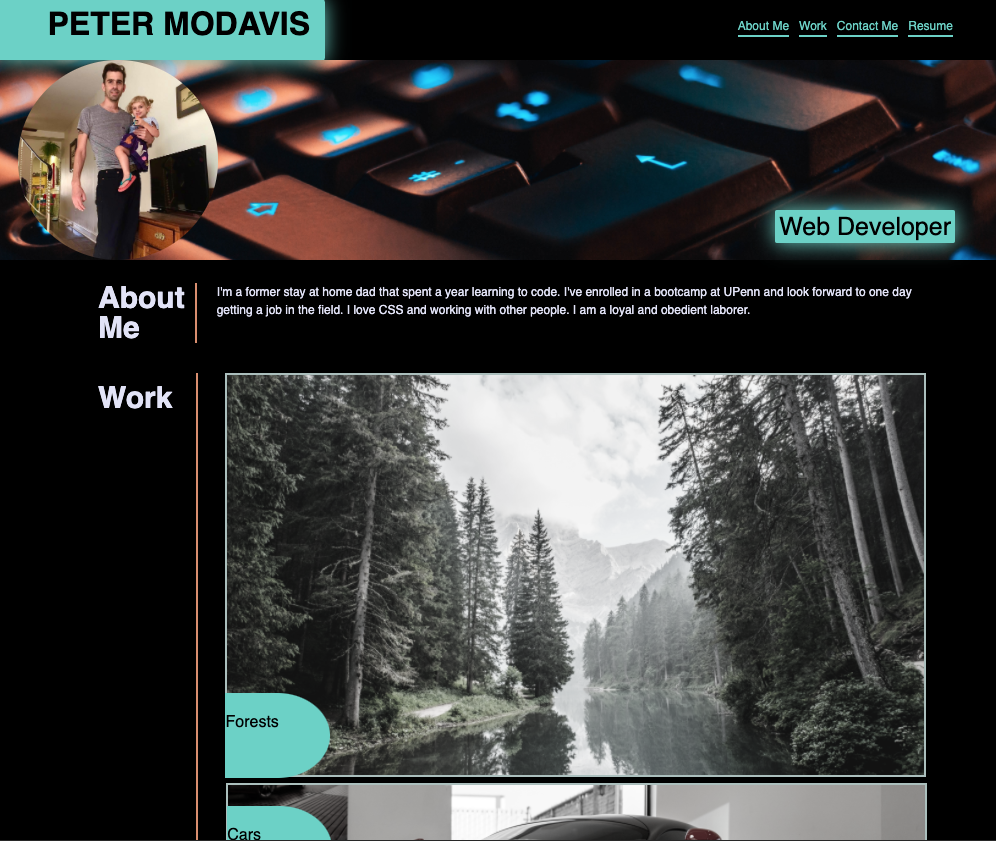
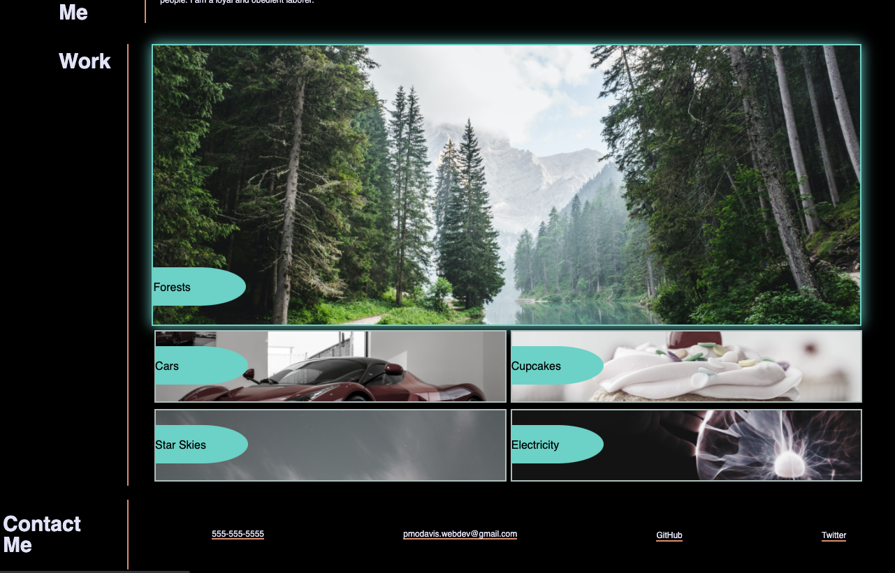

# Portfolio

# <Your-Project-Title>

## Description

For this project I wanted to begin my journey building a fantastic personal portfolio. I hope to use it in the future to gain employment as a web developer. Hopefully this will be of use to me when applying for jobs and showing prospective employers my projects and accomplishments. While working on it I learned a great deal about CSS including using Flexbox, utilizing the inspector, and how to work under pressure/manage my workflow.

See Application [HERE](https://petermodavis.github.io/portfolio/)

## Usage

To use this app you just have to click the top links and the screen will scroll to the proper section. If you click on one of the work images it will take you to that project. When hovering over the images, they will begin to glow.

## License

MIT License

Copyright (c) [2021] [Peter MoDavis]

Permission is hereby granted, free of charge, to any person obtaining a copy
of this software and associated documentation files (the "Software"), to deal
in the Software without restriction, including without limitation the rights
to use, copy, modify, merge, publish, distribute, sublicense, and/or sell
copies of the Software, and to permit persons to whom the Software is
furnished to do so, subject to the following conditions:

The above copyright notice and this permission notice shall be included in all
copies or substantial portions of the Software.

THE SOFTWARE IS PROVIDED "AS IS", WITHOUT WARRANTY OF ANY KIND, EXPRESS OR
IMPLIED, INCLUDING BUT NOT LIMITED TO THE WARRANTIES OF MERCHANTABILITY,
FITNESS FOR A PARTICULAR PURPOSE AND NONINFRINGEMENT. IN NO EVENT SHALL THE
AUTHORS OR COPYRIGHT HOLDERS BE LIABLE FOR ANY CLAIM, DAMAGES OR OTHER
LIABILITY, WHETHER IN AN ACTION OF CONTRACT, TORT OR OTHERWISE, ARISING FROM,
OUT OF OR IN CONNECTION WITH THE SOFTWARE OR THE USE OR OTHER DEALINGS IN THE
SOFTWARE.

## Badges

